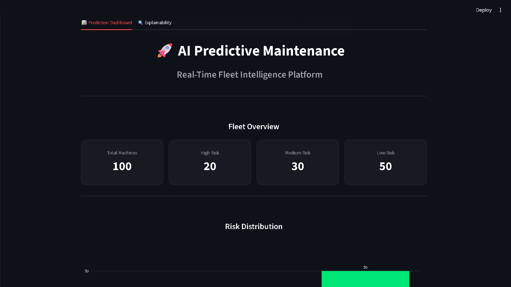
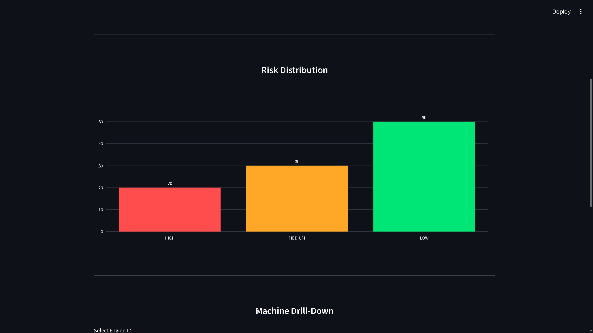
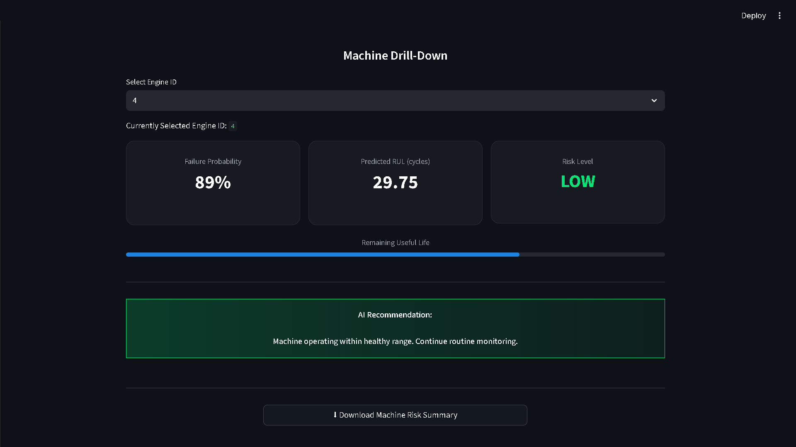
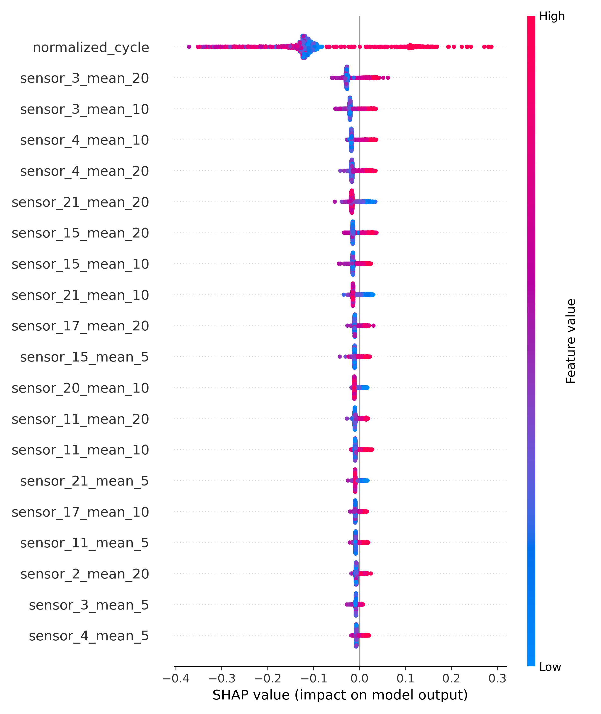
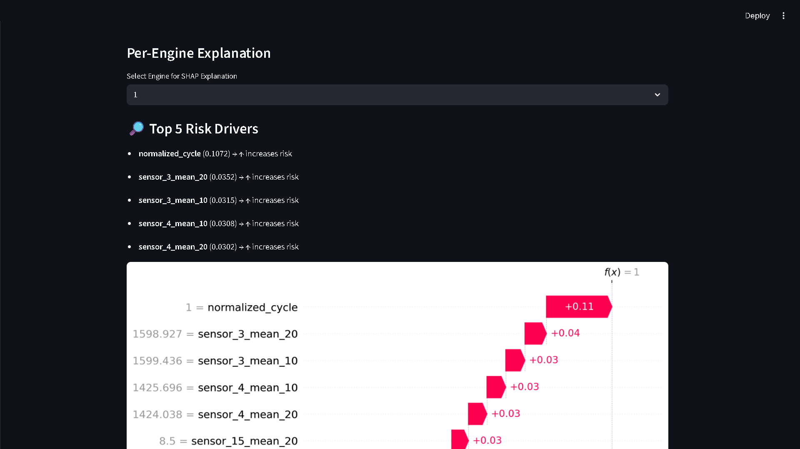

# 🏭 AI-Driven Predictive Maintenance & Failure Risk Analytics for Manufacturing Equipment

### Real-Time Fleet Intelligence Platform for Industrial Failure Prediction

An enterprise-grade AI predictive maintenance system that forecasts machine failure risk, estimates Remaining Useful Life (RUL), and provides explainable AI-driven operational insights using sensor telemetry data.

This platform combines machine learning, fleet intelligence monitoring, SHAP explainability, and interactive Streamlit dashboards to simulate Industry 4.0 predictive maintenance workflows.

---

# 📌 Project Overview

Modern industrial systems generate massive volumes of sensor telemetry data from engines, turbines, and manufacturing equipment. Unexpected failures can lead to:

- production downtime
- maintenance cost escalation
- operational disruption
- supply-chain delays
- equipment safety risks

This project builds an AI-powered predictive maintenance platform capable of:

✅ Predicting machine failure risk  
✅ Estimating Remaining Useful Life (RUL)  
✅ Monitoring fleet-wide operational health  
✅ Explaining AI predictions using SHAP  
✅ Providing maintenance recommendations  
✅ Supporting Industry 4.0 operational intelligence

---

# 🏭 Industry 4.0 AI Operations

This project simulates Industry 4.0 predictive maintenance workflows using explainable AI, fleet intelligence dashboards, and machine-level operational risk monitoring.

The platform is designed to resemble real-world industrial AI systems used in:

- manufacturing analytics
- aerospace engine monitoring
- industrial IoT platforms
- operational intelligence systems
- predictive asset maintenance

---

# ✨ Key Features

## 🔍 Predictive Failure Analytics

- Predict machine failure probability
- Estimate Remaining Useful Life (RUL)
- Identify high-risk engines
- Detect operational degradation patterns

---

## 📊 Fleet Intelligence Dashboard

Interactive Streamlit dashboard with:

- fleet-wide KPIs
- risk segmentation
- machine-level drill-down
- operational health monitoring
- AI-generated maintenance recommendations

---

## 🧠 Explainable AI (XAI)

Integrated SHAP explainability for transparent AI decision-making.

Includes:

- SHAP summary plots
- SHAP feature importance
- SHAP waterfall explanations
- per-engine explainability

---

## ⚙️ Operational Recommendations

The platform generates AI-driven maintenance recommendations based on predicted operational risk.

Examples:

- Continue routine monitoring
- Schedule preventive inspection
- Prioritize maintenance intervention
- Escalate critical-risk machinery

---

# 🛠️ Tech Stack

| Category            | Technologies          |
|---------------------|-----------------------|
| Programming         | Python                |
| Machine Learning    | XGBoost, Scikit-learn |
| Explainable AI      | SHAP                  |
| Dashboard           | Streamlit             |
| Data Processing     | Pandas, NumPy         |
| Visualization       | Matplotlib, Plotly    |
| Model Serialization | Pickle                |
| Deployment Ready    | Streamlit Cloud       |

---

# 📊 Dataset Used

This project uses industrial sensor telemetry data commonly used in predictive maintenance and Remaining Useful Life (RUL) estimation research.

### Dataset Characteristics

- engine sensor telemetry
- operational cycle data
- degradation behavior patterns
- machine health indicators
- failure progression signals

### AI Objectives

- machine failure prediction
- Remaining Useful Life estimation
- operational risk segmentation
- predictive maintenance intelligence

---

# 📂 Project Structure

```plaintext
AI-Predictive-Maintenance/
│
├── dashboard/
│   └── app.py
│
├── data/
│   ├── raw/
│   └── processed/
│
├── models/
│   ├── RF_Regressor_rul_regressor.pkl
│   └── RF_Classifier_failure_classifier.pkl
│
├── outputs/
│   ├── shap_waterfall.png
│   ├── machine_drilldown.png
│   ├── risk_distribution.png
│   ├── dashboard_overview.png
│   ├── dashboard_engine_1_shap_waterfall.png
│   ├── dashboard_shap_summary_plot.png
│   ├── shap_bar_plot.png
│   └── shap_summary_plot.png
│
├── reports/
│   └── executive_summary.md
│
├── src/
│   ├── preprocessing.py
│   ├── feature_engineering.py
│   ├── train_model.py
│   ├── evaluate_model.py
│   ├── explain_model.py
│   └── generate_predictions.py
│
├── requirements.txt
├── README.md
└── .gitignore
```

---

# 📈 Machine Learning Pipeline

## 1️⃣ Data Preprocessing

- sensor telemetry cleaning
- missing value handling
- scaling & normalization
- cycle normalization
- rolling statistical features

---

## 2️⃣ Feature Engineering

Engineered features include:

- rolling sensor means
- cycle-based degradation indicators
- operational trend signals
- normalized lifecycle metrics

---

## 3️⃣ Predictive Modeling

The platform trains machine learning models for:

- machine failure prediction
- Remaining Useful Life estimation
- operational risk scoring

---

## 4️⃣ Explainable AI

SHAP explainability provides:

- feature impact analysis
- model transparency
- operational interpretability
- engineering trust

---

# 🔍 Explainable AI & Responsible Operations

The platform integrates SHAP-based explainability to improve operational transparency, engineering trust, and responsible deployment of predictive maintenance systems.

Explainability is critical for:

- industrial AI governance
- maintenance prioritization
- engineering validation
- operational confidence
- AI transparency

---

# 📸 Dashboard Screenshots

## 🏠 Dashboard Overview



---

## 📊 Risk Distribution



---

## ⚙️ Machine Drill-Down



---

## 🧠 SHAP Summary Plot



---

## 🔍 SHAP Waterfall Explanation



---

# ⚙️ Operational Use Cases

- Predictive maintenance monitoring
- Fleet reliability intelligence
- Industrial asset monitoring
- Remaining Useful Life estimation
- Maintenance prioritization
- Failure risk forecasting
- Industry 4.0 transformation workflows
- Smart manufacturing analytics
- Industrial IoT monitoring

---

# 📊 Sample Operational Insights

The AI system can identify:

- engines approaching operational failure
- degradation acceleration patterns
- high-risk sensor signatures
- maintenance prioritization opportunities
- fleet-wide operational trends

---

# 🚀 How to Run the Project

This workflow generates:
- trained predictive maintenance models
- Remaining Useful Life predictions
- fleet-level risk segmentation
- SHAP explainability reports
- operational maintenance intelligence dashboards

---

## 1️⃣ Clone Repository

```bash
git clone https://github.com/your-username/AI-Predictive-Maintenance.git

cd AI-Predictive-Maintenance
```

---

## 2️⃣ Create Virtual Environment

### Windows

```bash
python -m venv venv
venv\Scripts\activate
```

### Mac/Linux

```bash
python3 -m venv venv
source venv/bin/activate
```

---

## 3️⃣ Install Dependencies

```bash
pip install --upgrade pip
pip install -r requirements.txt
```

---

## 4️⃣  Data Preprocessing

```bash
python src/preprocessing.py
```

---

## 5️⃣  Feature Engineering

```bash
python src/feature_engineering.py
```

---

## 6️⃣  Train Models

```bash
python src/train_model.py
```

---

## 7️⃣  Evaluate Models

```bash
python src/evaluate_model.py
```

---

## 8️⃣  Generate Predictions

```bash
python src/predict.py
```

---

## 9️⃣  Generate SHAP Reports

```bash
python src/explain_model.py
```

---

## 🔟 Launch Dashboard

```bash
streamlit run dashboard/app.py
```

---

# 📌 Future Enhancements

- Real-time streaming telemetry
- IoT integration
- MLOps pipeline automation
- cloud deployment
- anomaly detection
- edge AI deployment
- maintenance scheduling optimization
- digital twin simulation

---

# 🎯 Business Impact

This system helps industrial organizations:

- reduce unplanned downtime
- improve asset reliability
- optimize maintenance scheduling
- lower operational costs
- improve equipment lifespan
- increase operational efficiency

---

# 📚 Learning Outcomes

This project demonstrates practical experience in:

- machine learning engineering
- predictive maintenance systems
- explainable AI
- industrial analytics
- operational intelligence
- dashboard engineering
- fleet monitoring systems
- Industry 4.0 workflows

---

# 👨‍💻 Author

Girish Shenoy

AI • Machine Learning • Predictive Analytics • Explainable AI • Industrial Intelligence

---

# ⭐ If You Found This Project Useful

Please consider giving this repository a ⭐ on GitHub.